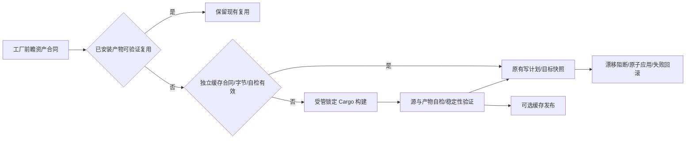

# 工厂独立构建产物缓存

本能力初始接入工厂 `WritePlan::prepare`，覆盖开发准备与实际 release；不接下游
project-sync，不读取 prepared/audit 来决定是否发布。产品实现事实源为
`templates/hooks/crates/bridgeforge-core/src/artifact_cache.rs` 与 `git_sync_plan.rs`；
用户选择、预算、测试和性能证据在 [R04 确认卡](../../1_delivery/refactor-scan/requirements_2026-10-10_r04-artifact-cache.md)。

## 数据流与边界

缓存根为项目 `.runtime/bridgeforge-codex/build-artifact-cache`，必须被 Git 忽略。
根 owner 绑定 schema、固定 producer 标识与规范化项目路径。稳定全局 FileLock 覆盖读、自检、
发布与维护；租用中的条目留在 protected 集合，缓存返回的字节仍进入原事务，不直接写安装文件。
缓存不是工程验收或授权记录，清空或不可用时回退到正常构建。

## 编译身份

键由 asset id、平台、二进制名称、source/lock/recipe/self-test 合同及环境身份组成。
版本由前瞻源码与自检合同绑定，不能用当前已安装版本代替目标版本。
环境探测通过已有 BuildInputs 在与真实构建同层级的临时 `source-0` 快照执行，而非项目根：
rustup 的项目固定和临时默认工具链可能不同。探测 Cargo/rustc 版本，绑定构建目录祖先与
Cargo home 配置哈希；TOML 按表解析，未知 build/target/env/patch/profile/compiler wrapper/
native 覆盖保守禁用缓存，不依赖字符串子串判断。未证明等价的配置仍正常构建。
输入快照在使用前后验证；数据命中必须同时满足真实二进制原始 SHA256、构建收据、自检输出
以及执行前后字节/编译环境稳定。元数据中的 hash 不能单独证明一次命中。

## 所有权、维护与中断

完整条目是 64 位摘要目录与闭合的二进制、receipt.json、entry.json。根 journal 明确绑定
schema/owner/project/key/binary/kind/nonce，以固定推导路径认领 stage、retired 与 touch 操作，
不用 glob 认领陌生文件。发布目录整体 rename；删除先将完整目录移到 retired，再按明确
journal 删除闭合文件；元数据 recency 的确切临时名写入 touch journal。
stage 元数据直接 create_new+sync，避免原子文件工具生成未登记临时名。半写 root journal
未认领任何产物，保留为未知占用而不阻塞其他发布。有效 journal 在全局锁内恢复，未知文件、
链接、占用和 owner 不匹配的数据保持，不递归扩大删除范围。

LRU 在锁内使用已验证成功序号 max+1，不能用系统时间回拨后的值排序。
每类产物/平台保留 2 份，总持久占用上限 256 MiB，计算根元数据、完整条目、未知占用与
操作余量。只逐出确认归属、未占用的条目；无安全空间则不发布缓存，正常构建继续。
不清理原 release-preparation blob、日志、Cargo target 或用户数据；只读状态/check 不触发缓存。

## 验证与限制

风险测试覆盖实际目录工具链、合法 TOML compiler/env 覆盖、数据/自检漂移、精确崩溃阶段、
单调排序、磁盘容量、Windows junction/open executable、独立缓存发布与混合命中回滚。
真实性能场景使用相同源码/目标/发布工作量的隔离工厂副本和本地 bare remote，分别移除或保留
成品缓存；prepared 记录刻意损坏以验证解耦。各场景先做同合同准备，不把预热成本混入 release
时钟。mock 的 Cargo 调用数证明分支，不能用模拟时间证明提速。
本机缓存不跨电脑同步，不代表用户桌面/runtime 或真实下游已验收；最终证据以 R04 卡和收据为准。
