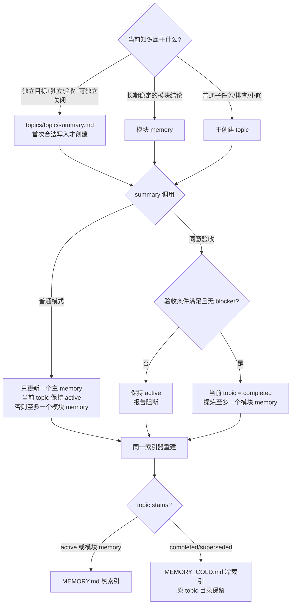

# 已退役：项目 Memory 索引设计（历史）

> **已退役设计**：本文只保留为历史设计证据，不再描述当前架构，也不得据此恢复项目
> `.codex/memory/` 的注入、检索、索引、写入或冷热区机制。当前边界见
> `design-rationale.md` 与 `codex-native-memory-sync.md`；运行时资产的实际清理属于
> `project-memory-retirement` P2。下文所有“必须 / 禁止”只记录旧系统当时的合同，不对当前
> 产品或下游项目生效；完成 P2 后再由 `$archive-scan` 提议移动本文。

> 状态：已退役历史设计（2026-08-30）；当前事实源见上方链接。
> 前身：艾宾浩斯热度评分系统（2026-06-03 设计、已实现），**本次废弃**，原因见下。
> 改版辩论：[debates_2026-06-27_memory-untrack.md](debates_2026-06-27_memory-untrack.md)

---

## 为什么废弃热度评分（核心）

旧系统按「最近访问热度 + 艾宾浩斯时间衰减」自动重排 MEMORY.md 的 Top-40 热区。致命缺陷：

**热度分 = `exp(-days_since_last / S)` 含 `today` 变量 → 索引是时间的函数 → 每天自发变化。**
这与用户硬需求「`/git-sync` 后工作区必须干净、不自发变脏、多机不莫名冲突」**在数学上不兼容**：只要分数随日期漂，被 git 跟踪的 MEMORY.md/MEMORY_COLD.md 就会在没人改 memory 的情况下天天 dirty（外加 COLD 顶部 `rebuilt {date}` 日期戳跨天必变）。

辅证：实测 `_stats.json` 长期仅 1 条访问记录、17 个 memory 全进 Top-40 → 热度是「伪热度」，截断毫无作用，属当前规模（数十条）下的过早优化。

> 决定性技术事实：git 只比对**内容**、不看 mtime。所以脏的唯一来源是「内容自发变化」，而非「hook 每轮重写」。消除自发变化即根治。

---

## 新设计：确定性 + 事件驱动

**索引 = f(memory 文件集, created_at, pinned)，不含 `today`、不含访问热度。**
→ 不碰 memory 时，重建产出逐字不变 → 工作区永不自发变脏；多机用同规则同输入算出一致结果 → 不冲突。

## 单一 schema 与交付生命周期

所有项目统一使用公共/分类模块 memory、`topics/<topic>/summary.md`、同一 writer、同一
索引器和同一冷热策略。项目规模不参与 schema 选择，`.bridgeforge_version` 继续只保存
单行骨架版本。



### 统一布局

初始化只创建 `MEMORY.md`；`architecture/`、`engineering/`、`domain/`、`operations/` 与
`topics/<exact-slug>/` 都在首次合法正文写入时创建，禁止预建空目录。所有项目共享同一
metadata schema、writer、索引器和冷热策略；禁止第二套实现或语义分类器。

### 模块 memory 与 topic memory 判定

- 模块 memory 回答“这个模块长期怎样工作”，只保存长期稳定、未来会重复检索的架构、
  接口、约束和工程结论。
- Topic memory 回答“这次独立交付为何做、做到哪里、是否关闭”，保存目标、决策、进度、
  验收和交付过程。完成后只把稳定知识提炼到模块 memory，禁止整份复制。
- 只有用户已确认且同时具备独立目标、独立验收条件、可独立关闭生命周期时才能建 topic。
  普通子任务、一次性排查、小修和里程碑子项不得建；主体完成后出现的独立后续交付应另建。
- 判断不唯一时保持现状并询问用户。机械层禁止根据人数、文件数、行数或关键词自动分类。

### Topic 创建、对账、关闭与冷却

1. 创建前对账 active topic，禁止重复建档；用户已确认独立交付即是创建授权，无需再问。
2. active topic 必须对应仍在推进的已确认交付。`$summary` 只列疑似完成、暂停或被替代但
   状态未更新的候选；状态不清楚时禁止自动关闭。
3. 禁止自动拆分、合并、改名或移动 topic。显式改名通过同一 lint/organize 机械路径执行，
   必须保留 `_stats.json.files[*].created_at` 并同步 `config.pinned` 路径。
4. 目录 slug 与 frontmatter `topic` 不一致时，dry-run 与 apply 都 fail closed；只有显式
   指定 exact slug 的整理命令才能改名。
5. `completed` / `superseded` 保留原目录，由索引器进入 `MEMORY_COLD.md`，不占热区；
   不创建 `memory/_archive/`，不限制历史 topic 总量。

### `$summary` 文档范围

| 模式 | Memory | TODO / rules / docs | 生命周期 |
|---|---|---|---|
| `$summary` | 只更新一个主 memory：当前 topic，或至多一个模块 memory | 全部禁止修改，只列候选 | 当前 topic 保持 active；调用本身不是验收 |
| `$summary 同意验收` | 更新当前 topic并至多提炼一个模块 memory | 只结算当前交付 TODO；只整理 `related_paths` 或需求卡明确关联文档；只有稳定“必须/禁止”可进 rule | blocker/条件不满足则阻断；满足时可 completed |

验收模式不修改其他 topic 或项目级 TODO，不自行扩建事实源文档，不自动归档，也不调用
`$archive-scan`。两种模式最终都调用同一确定性索引器。

```
.<host>/memory/
├── MEMORY.md          # 主索引（派生，自动加载前 200 行）—— 勿手改
├── MEMORY_COLD.md     # 冷区索引（派生，不自动加载，/find-memory 的目录）
├── _stats.json        # 事实源：config(title/pinned) + 各文件 created_at（登记一次，固定）
├── architecture/*.md  # 长期架构结论（首次真实写入时创建）
├── engineering/*.md   # 长期工程结论（首次真实写入时创建）
├── domain/*.md        # 长期领域结论（首次真实写入时创建）
├── operations/*.md    # 长期运维结论（首次真实写入时创建）
└── topics/<topic>/summary.md  # 满足创建门槛的独立交付事实源
```

### 排序与容量
- **Pinned**（≤5，`config.pinned` 声明）置顶，永不滚出。
- 其余按 **created_at 倒序**（新增的在前），并列按文件名升序。
- 主索引（Active）保留 **ACTIVE_N=40** 条；超出的**自动滚入冷区**（MEMORY_COLD.md）。
- → 冷热维护全自动、不需人工决定；只在真增删 memory 时变（那本就该提交）。

### created_at
- 文件首次被 rebuild 看到时登记 `today`，此后**固定不变**（确定性的锚）。
- rebuild 同时清理 `_stats.json` 里已不存在的文件记录（单一事实源）。
- `_stats.json` 仅在「真增删 memory」时被追加/删除 → 与 MEMORY.md 同步变，不自发脏。

### 触发时机
- **PostToolUse(Write|Edit)** 调 `memory_rebuild_index.py --from-hook`：读 stdin，**仅当写入对象是当前宿主 `.<host>/memory/**/*.md`（非 MEMORY*.md、非 `_*`）时才重建**（防自触发循环 + 避免无谓执行）。
  → memory 写入的当下即同步索引；sync 时已最新；Stop 不再碰索引 → 不会「sync 后又被弄脏」。
- **SessionStart** 调 `memory_rebuild_index.py`（无参，无条件）：clone 新机 / pull 后首个 session 兜底对齐。
- **Codex SessionStart** 索引重建成功后由 `memory_context.py` 注入最多 6000 字符的
  `MEMORY.md`；这一步才是“进入本轮上下文”的确定性证据，不能用“文件已存在”代替。
- **Codex UserPromptSubmit** 由 `memory_router.py` 按 topic/path、tags、name/description、
  正文词频、created_at 的顺序返回最多 5 个候选。`PostToolUse(Read)` 只在正文成功读取后
  写 used 回执，运行事件只进 `.runtime/memory_usage.jsonl`，禁止回写 `_stats.json`。

---

## 组件清单（退役前）

| 组件 | 位置 | 触发 | 职责 |
|---|---|---|---|
| `memory_rebuild_index.py` | `scripts/` | PostToolUse(--from-hook) + SessionStart | 确定性生成 MEMORY.md + MEMORY_COLD.md |
| `memory_context.py` | Codex `scripts/` | SessionStart | 有预算地注入项目热索引 |
| `memory_router.py` | Codex `scripts/` | UserPromptSubmit + PostToolUse(Read) | 自动候选与真实读取回执 |
| `memory_usage.py` | Codex `scripts/` | router 调用 | 只写 `.runtime` 的运行事件 |
| `memory_search.py` | `scripts/` | router + `$find-memory` | metadata 加权递归搜索全量 memory |
| `find-memory` skill | `skills/find-memory/` | agent 兜底调用 | 自动候选不足时深度检索 |
| `_stats.json` | `memory/` | rebuild 维护 | created_at + pinned/title（事实源，纳入 git） |

**已删除**（随热度系统废弃）：`memory_access_tracker.py`（PostToolUse/Read 访问追踪）、`memory_bootstrap_cold.py`（衰减冷启动工具）、`_stats.json` 的 `session_dates`、MEMORY_COLD.md 日期戳、艾宾浩斯评分。

---

## 关键不变量
- **确定性**：相同（memory 文件集 + created_at + pinned）→ 逐字相同的 MEMORY.md/COLD。可连跑 N 次验证 diff 为空。
- **git 边界**：MEMORY.md/COLD 留在 git（确定性 → 多机一致、可 diff 兜底），但内容只在真增删 memory 时变。
- **可删除性**：`rm MEMORY.md` 无后果，下个 PostToolUse/SessionStart 自动重生。
- **description 依赖**：索引每条描述取自该 memory 的 `description:` 字段；写 memory 时该字段必须是**纯文本**（勿用 YAML 引号/转义，否则提取出半截）。
- **双机制隔离**：项目 `.<host>/memory/` 由项目 Git、索引器和 summary 维护；Codex 原生
  `~/.codex/memories/` 由 Codex 自身生成。两者禁止 junction、混写或互相替代。

## Codex 原生 memories 云同步边界（历史说明）

BridgeForge 把 `~/.codex/memories/` 当作不透明整树。用户明确同意后，用户级 hook 与
`$bridgeforge` 才把它同步到固定 private 仓库 `bridgeforge-codex-memories`：每次只保留
一个 parentless 快照提交，以 `--force-with-lease` 替换；本地和远端都变化时按整树中最新
文件时间选一整套，禁止逐文件拼接。同步只支持单写入设备，失败告警但不阻断对话。

---

## 多机协作走查
A 新增 memory `foo.md`（带 description）+ 可选置顶（`config.pinned` 加 `foo.md`）→ A 本地 PostToolUse 重建 MEMORY.md → `git-sync` 提交 `foo.md` + `_stats.json` + MEMORY.md/COLD（全部内容确定）→ B `pull` 拿到事实源 → B 的 SessionStart 重建，因规则与输入一致 → 算出与 A **逐字相同**的索引，不冲突。
